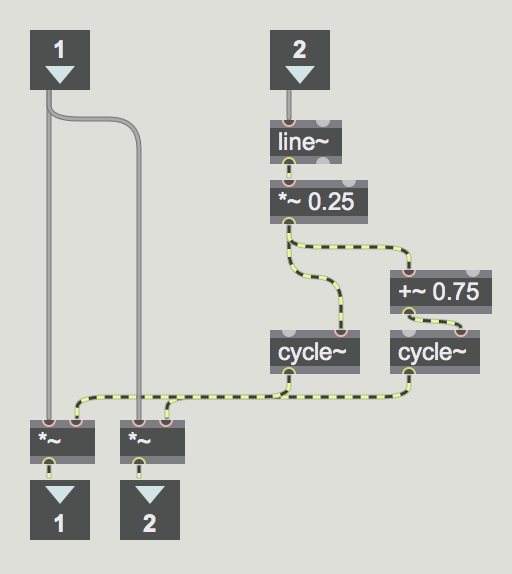

## Panning

Panning can be achieved a number of ways in M4L, there are the **M4L.pan1~** and **M4L.pan2~** objects that come with the installation. Both versions work with messages to control the panning position which is problematic for modulation.

In the example below, the patch is much simplified and works with an audio signal controlling the panning position.

### List of Objects:
* line~
* *~
* +~
* cycle~
* inlet / outlet
* live.dial

### Compressed Code

><pre><code>
----------begin_max5_patcher----------
1341.3oc2Y80iiZCD+4jOEQ7X61H9ef9V+.bRUpOt5TjC3v5qFajwr2t8zce
1qw1.1DHgsJI6d8EvLyX6Y94YFa77s0qbNPeAV6r42273lUq915UqjjZIrR+
8JmRvKYXPsTLGL5Y31bD.67fh6y.FATBmlIsgigb9qUP0b337vFmiXJf6r4y
ZYp.7rmPjh8LXFWIlWp6V2G13EF19R+b2V299PZJQDwHK0Iu9AhITDNjsGR.
GvPKdLXMjvAbDkXNQw9WbhT1fbl70TQ4Rykd3K+VPbmsVCdFluGv4LzgFNbn
UsFN03YKjgafzicj6naZAXJoXVX0Rx5mnLdun+IfLkPcq.tSvCQPbwXeJnMk
TJXKNb.hrjpQHUM+U0v3p3+80qGdIe980OrPuMB7qBPtCg4vWjqaNUaD14mn
D5r9Y0HA7ga81zsNq6lxKv2U9Zm5CeCufiTx.D+GLCGbKGQ+E6zD16zzAVNN
FyUM5eTKDsphgZCYickNhvvmgrZgas4JmCnpxfrsWVI3KT4.sqeETXDJRA8j
XvmQc8OrmJfI.Ot.4ZXJ09k3vAGtRZNjQZPRUoa0uSkFv6fXWEduS9JJV9Jw
HtS3WTfoY+ML2zq0gVAIHhYrrE6b3QPClueZHzl+QPFb1NO4Z8JmBFJW3zIT
BKrtkb2zIblhjYThLMFoDDP0DcV3NHvkYXVKLxl5C.V6RgN3zuiImRw1r56G
FdjqYWgHjQnHmVMOSFp3oyz2CTAyxyM1RN0hLAJt6Ewx78s4FskCfw5fa6g+
E.AUB3PNRsD361yTkf5o5LFEisrWEmmmfStvKNC9UTN+I4DY5LHDGU04D4zu
JmiJf0baZbPQsMkSBbEjZNniR2ygkUXgUXKf0lslgjloAsnetzg1oDwHB7Gl
bNSJwC.RgyP96YRJFHcjUgpAwiyINa1u4y.NNKnWho9Z.ncD06bzsgw+EDSo
ENm2T0oiBUlZ+y4MUuYMU2YL03YLUCpYzxRQZsSniH4Poo5euwEUpraJtDcE
vEuqHtHskyFFc4.m9M.VFn4NKn4MCnE9SGnYej+Kjx4VBcAevhCOSF8rWyvK
Kk9Ew0TEtFKeEFMYt74O2yaHS+Lvd5kQ8wmY6mNLN3cFiS9nhw+5ODG6ZWz0
zQVg0Qd2cPd2GUP9WZAY+nqnmr5JXBSu6Xb7GWL9Z.u5Ca5o1dyeazcFdC++
M7pOy56F7FbUf2gqNn8+5l4eFkVeK+ow8ZZCKqC8z6BuwFHD+CLGQ5uHkG68
P13YIWIJuhhHbsh36F1hqdoIsfbRfLmb6Ga97hbUdqJdxBU7fKo3s2y6fhGj
bqU7cKTwSUJ9MQGhWnNjrTvSCa6b6+xpWTVt5ZJ8dWMmSg9YLG+.0cQN70zl
i6MwbZ+WtE6aeWA5EqYgWBo8kPaj7jDwocsumnbvBMk1qiXysJYvRwSu3anR
3szbo2TkXwqGIypEC6PJ2jclsHG1kuIGQ+K40ou+SPRyv9wcW7+z59ghiHLN
ihoLCALjPb.F8YTbTR8fAq998X6oySC87RD1y1.ufc9wxVhFQQiR7p6mWWGC
iBSc8aEOL1eWXjrUhePTPaK2I5p+vb55kplI2zD2PUKAIOwbNtq.RgtDC6Ft
mbc0SoUTVe8V1FjZ0uFNsfAxQ5aMoOFdX8ZnLPpxEJjbpyF4TJVHPliQ6B8Z
yAPWlUUYSNSMVeSWueAld.f0WdeuOy4tq+gBBbZwMknp8A2T05bbbhthmmlt
J1bu341PHb3PCVS7nR+0NIiJ42nx8cZo9luLeiKwmXl+95+0uzaZC
-----------end_max5_patcher-----------
</code></pre>
